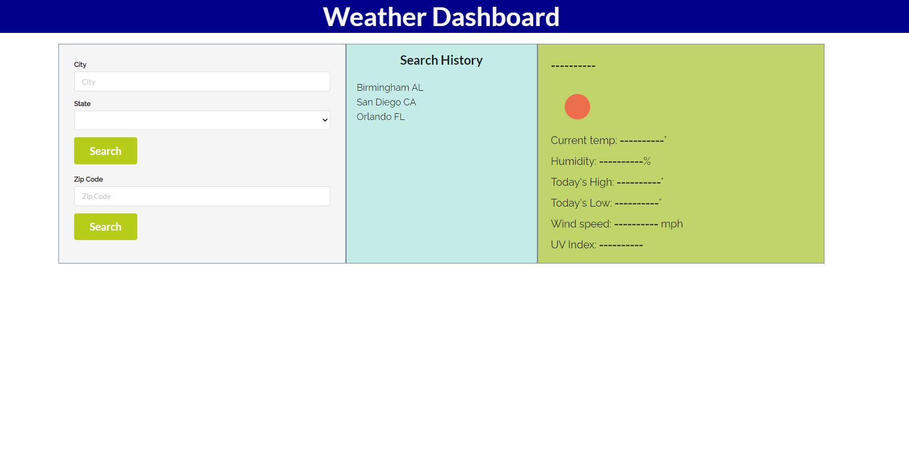
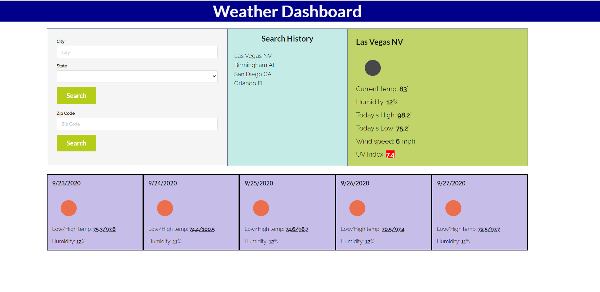
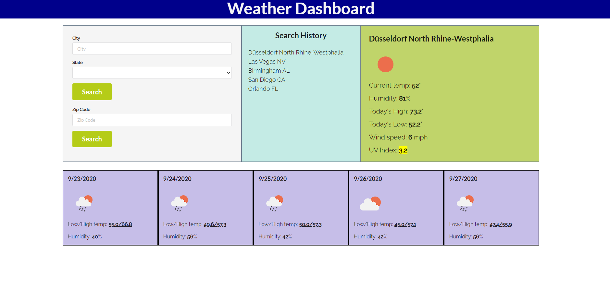

# weather-dashboard

## Description
-----------------------------------------

This is a weather dashboard that I have built using HTML, CSS, JavaScript, and multiple libraries and third-party APIs. 

The project uses Semantic UI for CSS, jQuery for DOM manipulation, moments.js to render the correct dates, MapQuest API to determine coordinates, and Openweather API for current and future weather dates. 

I decided to use Mapquest for coordinates because I was having trouble finding accurate coordinates for certain cities with Openweather. When I searched for a city that has the name of a larger city, I only found data for the larger city with Openweather (for example, I couldn't look up data for places like Berlin, NH, San Diego, Texas, and even some capitol cities like Charleston, WV). I found that Mapquest was easier to add states to, making searches for these types of cities possible. 

The project also uses local storage to save searches for later reference. I have made it so that the recent searches are limited to 10, with the oldest being removed when an 11th is added. I tried to make it so that a city can not appear twice in the recent storage, and based on my testing, it seems to work. 

## Links
-------------------------------------------

Deployed app: https://jjbidwell.github.io/weather-dashboard/
Github repository: https://github.com/jjbidwell/weather-dashboard

## Screenshots
----------------------------------------------

